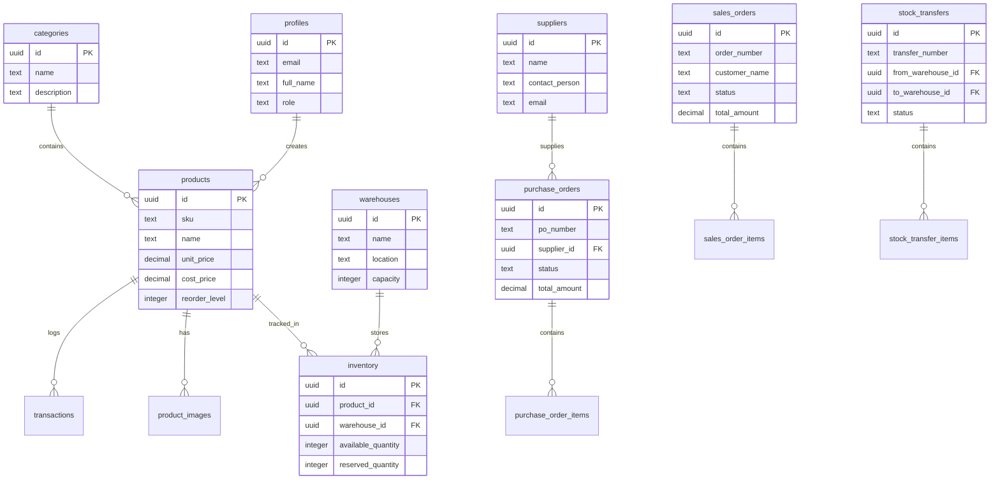

<div align="center">

# 💊 MediStock — Medicine Inventory Management System

**A full-stack, enterprise-grade inventory management platform for pharmacies, hospitals, and medical stores**

Built with **Next.js 16**, **Supabase**, **TypeScript**, and **shadcn/ui**

[](https://inventory-management-hazel-nine.vercel.app)
[](https://nextjs.org/)
[](https://supabase.com/)
[](https://www.typescriptlang.org/)
[](https://tailwindcss.com/)
[](https://react.dev/)
[](LICENSE)

🔗 **Live Demo:** [inventory-management-hazel-nine.vercel.app](https://inventory-management-hazel-nine.vercel.app)

</div>

---

## 📋 Table of Contents

- [Overview](#-overview)
- [Key Features](#-key-features)
- [Tech Stack](#️-tech-stack)
- [System Architecture](#-system-architecture)
- [Database Schema](#️-database-schema)
- [User Roles & Permissions](#-user-roles--permissions)
- [Screenshots](#-screenshots)
- [Getting Started](#-getting-started)
- [Environment Variables](#-environment-variables)
- [Database Setup](#️-database-setup)
- [Deployment](#-deployment)
- [Project Structure](#-project-structure)
- [API Routes & Pages](#-api-routes--pages)
- [Documentation](#-documentation)
- [Contributing](#-contributing)
- [License](#-license)

---

## 🔍 Overview

**MediStock** is a comprehensive, production-ready medicine inventory management system designed specifically for **pharmacies**, **hospitals**, and **medical supply stores**. It provides end-to-end inventory lifecycle management — from supplier procurement to customer sales — all wrapped in a modern, responsive, and dark-mode-ready interface.

### Why MediStock?

| Challenge | MediStock Solution |
|---|---|
| Tracking stock across multiple warehouses | Multi-warehouse real-time inventory dashboard |
| Manual purchase & sales order workflows | Automated PO/SO pipelines with status tracking |
| No visibility into low-stock items | Smart low-stock alerts with configurable thresholds |
| Lack of role-based access control | Enterprise RBAC with 4 permission levels |
| Paper-based invoicing | Automatic PDF invoice generation |
| No barcode/QR integration | Built-in barcode & QR code generation per product |
| Limited reporting | Comprehensive analytics with charts & CSV export |

---

## ✨ Key Features

### 📦 Core Inventory Management
- **Product Management** — Full CRUD with SKU generation, multi-image upload (drag & drop), barcode/QR code generation
- **Warehouse Management** — Create and manage multiple warehouse locations with capacity tracking
- **Real-Time Inventory** — Live stock levels across all warehouses with automatic quantity updates
- **Low Stock Alerts** — Configurable reorder levels with visual alerts on the dashboard

### 🛒 Order Management
- **Purchase Orders (PO)** — Complete workflow: Draft → Sent → Partial → Received → auto-inventory-update
- **Sales Orders (SO)** — Full fulfillment pipeline: Pending → Processing → Shipped → Delivered
- **Stock Transfers** — Move inventory between warehouses with tracking and validation
- **PDF Invoice Generation** — Professional invoices generated directly from sales orders

### 📊 Analytics & Reporting
- **Dashboard** — KPI cards (total products, warehouses, low stock count, inventory value), recent transactions
- **Inventory Valuation** — Real-time value by warehouse and by product
- **Sales & Purchase Analytics** — Trend charts, top products, order volume tracking
- **Stock Movement Reports** — Track all transactions with filtering and CSV export

### 🔐 Security & Authentication
- **Google OAuth + Email/Password** — Secure authentication via Supabase Auth
- **Role-Based Access Control (RBAC)** — Admin, Manager, Staff, and Viewer roles
- **Row-Level Security (RLS)** — PostgreSQL RLS policies enforce permissions at the database level
- **Auto Profile Creation** — New user profiles are created automatically on signup

### 🎨 User Experience
- **Modern UI** — Built with shadcn/ui (Radix UI primitives) for a polished, accessible interface
- **Dark Mode** — Full dark/light theme support via next-themes
- **Responsive Design** — Optimized for desktop, tablet, and mobile viewports
- **Smooth Animations** — Framer Motion-powered transitions and micro-interactions
- **Toast Notifications** — Real-time feedback for all user actions via Sonner

---

## 🛠️ Tech Stack

### Frontend
| Technology | Purpose | Version |
|---|---|---|
| **Next.js** | React framework with App Router, SSR, file-based routing | 16 |
| **React** | UI library | 19 |
| **TypeScript** | Type-safe JavaScript | 5.9 |
| **Tailwind CSS** | Utility-first CSS framework | 4 |
| **shadcn/ui** | Accessible UI component library (Radix UI) | Latest |
| **Framer Motion** | Animation library | 12 |
| **Recharts** | Chart library for analytics dashboards | 3.7 |
| **React Hook Form** | Performant form handling | 7 |
| **Zod** | Schema validation for forms | 4 |

### Backend & Infrastructure
| Technology | Purpose | Version |
|---|---|---|
| **Supabase** | Backend-as-a-Service (PostgreSQL, Auth, Storage, RLS) | Latest |
| **Supabase Auth** | Authentication (Google OAuth + email/password) | — |
| **Supabase Storage** | File storage for product images | — |
| **Vercel** | Hosting & deployment | — |

### State Management & Data Fetching
| Technology | Purpose |
|---|---|
| **Zustand** | Lightweight client-side state management |
| **TanStack React Query** | Server state management, caching, and synchronization |

### Additional Libraries
| Library | Purpose |
|---|---|
| **jsPDF + jspdf-autotable** | PDF invoice generation |
| **qrcode.react** | QR code generation for products |
| **react-barcode** | Barcode generation for products |
| **react-dropzone** | Drag & drop image upload |
| **date-fns** | Date formatting & manipulation |
| **lucide-react** | Icon library |
| **sonner** | Toast notification system |

---

## 🏗 System Architecture

```
┌─────────────────────────────────────────────────────────────┐
│                        Client (Browser)                      │
│  ┌──────────┐  ┌──────────┐  ┌──────────┐  ┌──────────┐    │
│  │ Dashboard │  │ Products │  │  Orders  │  │ Reports  │    │
│  └────┬─────┘  └────┬─────┘  └────┬─────┘  └────┬─────┘    │
│       │              │              │              │          │
│  ┌────┴──────────────┴──────────────┴──────────────┴─────┐   │
│  │           Next.js 16 App Router (SSR + CSR)           │   │
│  │    ┌─────────────┐  ┌────────────┐  ┌─────────────┐   │   │
│  │    │  Zustand     │  │  React     │  │  React Hook │   │   │
│  │    │  (State)     │  │  Query     │  │  Form + Zod │   │   │
│  │    └─────────────┘  └────────────┘  └─────────────┘   │   │
│  └───────────────────────┬───────────────────────────────┘   │
└──────────────────────────┼───────────────────────────────────┘
                           │ HTTPS
┌──────────────────────────┼───────────────────────────────────┐
│                    Supabase Cloud                             │
│  ┌───────────────┐  ┌────┴──────┐  ┌────────────────────┐   │
│  │  Auth Service  │  │ PostgREST │  │  Storage Service   │   │
│  │  (Google OAuth │  │  (API)    │  │  (Product Images)  │   │
│  │  + Email/Pass) │  │           │  │                    │   │
│  └───────┬───────┘  └────┬──────┘  └────────────────────┘   │
│          │               │                                    │
│  ┌───────┴───────────────┴──────────────────────────────┐    │
│  │              PostgreSQL Database                      │    │
│  │   ┌─────────┐ ┌──────────┐ ┌────────────────────┐    │    │
│  │   │  Tables  │ │  Views   │ │  Row Level Security │    │    │
│  │   │  (14)    │ │  (2)     │ │  Policies (20+)     │    │    │
│  │   └─────────┘ └──────────┘ └────────────────────┘    │    │
│  └──────────────────────────────────────────────────────┘    │
└──────────────────────────────────────────────────────────────┘
```

---

## 🗄️ Database Schema

The system uses **14 tables** with **Row-Level Security (RLS)** enabled on every table:



### Tables Overview

| # | Table | Description |
|---|---|---|
| 1 | `profiles` | User profiles extending Supabase Auth (role, name, avatar) |
| 2 | `categories` | Product categories with optional parent (hierarchical) |
| 3 | `products` | Medicine/product catalog with SKU, pricing, reorder levels |
| 4 | `product_images` | Multiple images per product with primary flag |
| 5 | `warehouses` | Storage locations with capacity and manager assignment |
| 6 | `inventory` | Stock levels per product per warehouse (available + reserved) |
| 7 | `transactions` | Audit log of all inventory movements |
| 8 | `suppliers` | Supplier contact and payment information |
| 9 | `purchase_orders` | Purchase order headers (supplier, warehouse, status) |
| 10 | `purchase_order_items` | Line items for purchase orders |
| 11 | `sales_orders` | Sales order headers (customer, status, total) |
| 12 | `sales_order_items` | Line items for sales orders |
| 13 | `stock_transfers` | Inter-warehouse transfer headers |
| 14 | `stock_transfer_items` | Line items for stock transfers |

---

## 🔒 User Roles & Permissions

MediStock implements enterprise-grade **Role-Based Access Control (RBAC)** with PostgreSQL Row-Level Security:

| Permission | Admin 👑 | Manager 📋 | Staff 👷 | Viewer 👁️ |
|---|:---:|:---:|:---:|:---:|
| **Dashboard** | ✅ Full | ✅ Full | ✅ Full | ✅ View Only |
| **Products** | ✅ Full CRUD | ✅ Full CRUD | ✅ Create | ✅ View |
| **Warehouses** | ✅ Full CRUD | 👁️ View | 👁️ View | 👁️ View |
| **Inventory** | ✅ Full CRUD | ✅ Full CRUD | ✅ Update | 👁️ View |
| **Purchase Orders** | ✅ Full CRUD | ✅ Full CRUD | ✅ Create/Update | 👁️ View |
| **Sales Orders** | ✅ Full CRUD | ✅ Full CRUD | ✅ Create/Update | 👁️ View |
| **Stock Transfers** | ✅ Full CRUD | ✅ Full CRUD | ✅ Create/Update | 👁️ View |
| **Suppliers** | ✅ Full CRUD | ✅ Full CRUD | 👁️ View | 👁️ View |
| **Reports & Export** | ✅ Full | ✅ Full | 👁️ View | 👁️ View |
| **User Management** | ✅ Manage Roles | 👁️ View | ❌ | ❌ |

---

## 📸 Screenshots

> Visit the live demo to explore: [inventory-management-hazel-nine.vercel.app](https://inventory-management-hazel-nine.vercel.app)

### Key Screens
- **Landing Page** — Professional landing with feature overview and CTA
- **Dashboard** — KPI cards, recent activity, low-stock alerts, charts
- **Product Catalog** — Searchable/filterable product list with images
- **Product Detail** — Multi-image gallery, barcode/QR, inventory by warehouse
- **Purchase Orders** — Create PO, receive items, auto-update inventory
- **Sales Orders** — Create SO, manage fulfillment, generate PDF invoices
- **Stock Transfers** — Initiate transfers between warehouses
- **Reports** — Inventory valuation, sales analytics, stock movement charts
- **Settings** — User profile, role management (admin only)

---

## 🚀 Getting Started

### Prerequisites

- **Node.js** v18 or later — [Download](https://nodejs.org/)
- **npm** (comes with Node.js)
- **Supabase** account — [Sign up free](https://supabase.com/)
- **Git** — [Download](https://git-scm.com/)

### 1. Clone the Repository

```bash
git clone https://github.com/AyushKumar535/Inventory-Management.git
cd Inventory-Management
```

### 2. Install Dependencies

```bash
npm install
```

### 3. Set Up Supabase

1. Create a new project at [supabase.com/dashboard](https://supabase.com/dashboard)
2. Go to **SQL Editor** and run the database schema:
   - Copy and paste the entire contents of `database/setup-new-supabase.sql` → **Run**
3. Then run the storage setup:
   - Copy and paste `database/storage-setup.sql` → **Run**

### 4. Configure Environment Variables

```bash
cp .env.example .env.local
```

Edit `.env.local` with your Supabase credentials (found in **Settings → API**):

```env
NEXT_PUBLIC_SUPABASE_URL=https://your-project-id.supabase.co
NEXT_PUBLIC_SUPABASE_ANON_KEY=your-anon-key-here
SUPABASE_SERVICE_ROLE_KEY=your-service-role-key-here
NEXT_PUBLIC_SITE_URL=http://localhost:3000
```

### 5. Run the Development Server

```bash
npm run dev
```

Open [http://localhost:3000](http://localhost:3000) in your browser.

### 6. Create Your Admin Account

1. Sign up on the app (email/password or Google)
2. Your account gets **viewer** role by default
3. Promote yourself to **admin** via Supabase SQL Editor:

```sql
UPDATE profiles SET role = 'admin' WHERE email = 'your-email@example.com';
```

---

## 🔑 Environment Variables

| Variable | Required | Description |
|---|:---:|---|
| `NEXT_PUBLIC_SUPABASE_URL` | ✅ | Your Supabase project URL |
| `NEXT_PUBLIC_SUPABASE_ANON_KEY` | ✅ | Supabase anonymous (public) API key |
| `SUPABASE_SERVICE_ROLE_KEY` | ✅ | Supabase service role key (server-side only) |
| `NEXT_PUBLIC_SITE_URL` | ✅ | Your app URL (`http://localhost:3000` for dev, Vercel URL for prod) |

> ⚠️ **Security**: Never expose `SUPABASE_SERVICE_ROLE_KEY` in client-side code. It's only used server-side.

---

## 🗄️ Database Setup

### Fresh Setup (New Supabase Project)

Run these in order in **Supabase SQL Editor**:

1. **`database/setup-new-supabase.sql`** — Creates all 14 tables, triggers, functions, RLS policies, views, and sample categories
2. **`database/storage-setup.sql`** — Creates the `product-images` storage bucket with access policies

### What It Creates

- ✅ 14 tables with full RLS
- ✅ Auto `updated_at` triggers on all tables
- ✅ Auto profile creation on user signup
- ✅ Inventory reservation on sales order creation
- ✅ Role-based RLS policies (admin/manager/staff/viewer)
- ✅ Helper functions (`user_role()`, `is_admin()`)
- ✅ Views for low stock alerts and inventory valuation
- ✅ Sample medicine categories (Antibiotics, Painkillers, Vitamins, etc.)

### Google OAuth Setup (Optional)

1. In Supabase → **Authentication → Providers → Google** → Enable
2. Add your Google OAuth Client ID and Secret
3. In Google Cloud Console, set redirect URI to:
   ```
   https://YOUR_SUPABASE_REF.supabase.co/auth/v1/callback
   ```
4. See [docs/GOOGLE_AUTH_SETUP.md](./docs/GOOGLE_AUTH_SETUP.md) for detailed instructions

---

## 🌐 Deployment

### Deploy on Vercel (Recommended)

🔗 **Live:** [inventory-management-hazel-nine.vercel.app](https://inventory-management-hazel-nine.vercel.app)

1. Push code to GitHub
2. Go to [vercel.com](https://vercel.com) → **New Project** → Import your repo
3. Add environment variables in **Settings → Environment Variables**:
   - `NEXT_PUBLIC_SUPABASE_URL`
   - `NEXT_PUBLIC_SUPABASE_ANON_KEY`
   - `SUPABASE_SERVICE_ROLE_KEY`
   - `NEXT_PUBLIC_SITE_URL` → your Vercel domain
4. Deploy!

**Post-deployment checklist:**

- [ ] Update **Supabase → Authentication → URL Configuration → Site URL** to your Vercel domain
- [ ] Add your Vercel domain to **Redirect URLs** in Supabase
- [ ] If using Google Auth, ensure redirect URIs are updated in Google Cloud Console

### Deploy on Other Platforms

```bash
# Build for production
npm run build

# Start production server
npm start
```

Set the same environment variables on your hosting platform.

---

## 📁 Project Structure

```
inventory-management/
├── 📂 database/                    # Database setup scripts
│   ├── setup-new-supabase.sql      # Main schema (run first)
│   ├── storage-setup.sql           # Storage bucket setup
│   ├── supabase-schema.sql         # Schema reference
│   ├── test-inventory-flow.sql     # Test data scripts
│   └── 📂 migrations/             # Incremental migrations
│
├── 📂 docs/                        # Detailed documentation (22 files)
│   ├── QUICK_START.md
│   ├── IMPLEMENTATION_STATUS.md
│   ├── RBAC_IMPLEMENTATION.md
│   ├── ROLE_PERMISSIONS_DETAILED.md
│   ├── GOOGLE_AUTH_SETUP.md
│   ├── SAMPLE_DATA.md
│   └── ...more
│
├── 📂 public/                      # Static assets
│   ├── favicon.ico
│   └── landing-hero.gif
│
├── 📂 src/
│   ├── 📂 app/                     # Next.js App Router (29 pages)
│   │   ├── 📂 (auth)/              # Auth pages
│   │   │   ├── login/page.tsx      # Email/password + Google login
│   │   │   └── signup/page.tsx     # User registration
│   │   ├── 📂 auth/
│   │   │   └── callback/route.ts   # OAuth callback handler
│   │   ├── 📂 dashboard/           # Protected app pages
│   │   │   ├── page.tsx            # Main dashboard with KPIs
│   │   │   ├── 📂 products/        # Product CRUD (list, detail, new, edit)
│   │   │   ├── 📂 warehouses/      # Warehouse CRUD
│   │   │   ├── 📂 inventory/       # Inventory tracking
│   │   │   ├── 📂 suppliers/       # Supplier management
│   │   │   ├── 📂 purchase-orders/ # PO workflow (list, detail, new, receive)
│   │   │   ├── 📂 sales-orders/    # SO workflow (list, detail, new)
│   │   │   ├── 📂 stock-transfers/ # Transfer workflow (list, detail, new)
│   │   │   ├── 📂 reports/         # Analytics & reports
│   │   │   └── 📂 settings/        # User profile & role management
│   │   ├── globals.css             # Global styles
│   │   ├── layout.tsx              # Root layout
│   │   └── page.tsx                # Landing page
│   │
│   ├── 📂 components/              # React components
│   │   ├── 📂 ui/                  # shadcn/ui base components
│   │   ├── 📂 layout/              # Sidebar, navigation, header
│   │   ├── 📂 products/            # Product-specific components
│   │   ├── 📂 suppliers/           # Supplier components
│   │   ├── 📂 purchase-orders/     # PO components
│   │   ├── 📂 warehouses/          # Warehouse components
│   │   └── 📂 providers/           # Context providers (theme, auth, query)
│   │
│   ├── 📂 hooks/                   # Custom React hooks
│   ├── 📂 lib/                     # Utilities & configuration
│   │   ├── 📂 supabase/            # Supabase client (client, server, middleware)
│   │   ├── 📂 hooks/               # Data-fetching hooks
│   │   ├── 📂 utils/               # Helper functions
│   │   └── 📂 validations/         # Zod validation schemas
│   └── 📂 types/                   # TypeScript type definitions
│
├── .env.example                    # Environment variable template
├── .gitignore
├── components.json                 # shadcn/ui configuration
├── eslint.config.mjs
├── next.config.ts                  # Next.js configuration
├── package.json
├── postcss.config.mjs
├── tsconfig.json
└── README.md                       # This file
```

---

## 🛣️ API Routes & Pages

### Authentication
| Page | Path | Description |
|---|---|---|
| Landing | `/` | Public landing page with feature overview |
| Login | `/login` | Email/password + Google OAuth sign-in |
| Sign Up | `/signup` | New user registration |
| OAuth Callback | `/auth/callback` | Handles Google OAuth redirect |

### Dashboard (Protected)
| Page | Path | Description |
|---|---|---|
| Dashboard | `/dashboard` | KPI overview, charts, recent activity |
| Products | `/dashboard/products` | Product catalog with search & filters |
| Product Detail | `/dashboard/products/[id]` | Full product info, images, inventory, barcode/QR |
| New Product | `/dashboard/products/new` | Add new product form |
| Edit Product | `/dashboard/products/[id]/edit` | Edit product details |
| Warehouses | `/dashboard/warehouses` | Warehouse list and management |
| Warehouse Detail | `/dashboard/warehouses/[id]` | Warehouse info and inventory |
| Inventory | `/dashboard/inventory` | Cross-warehouse inventory view |
| Suppliers | `/dashboard/suppliers` | Supplier directory |
| Supplier Detail | `/dashboard/suppliers/[id]` | Supplier info and PO history |
| Purchase Orders | `/dashboard/purchase-orders` | PO list with status tracking |
| PO Detail | `/dashboard/purchase-orders/[id]` | PO details and line items |
| New PO | `/dashboard/purchase-orders/new` | Create purchase order |
| Receive PO | `/dashboard/purchase-orders/[id]/receive` | Receive items and update inventory |
| Sales Orders | `/dashboard/sales-orders` | SO list with fulfillment status |
| SO Detail | `/dashboard/sales-orders/[id]` | SO details + generate invoice |
| New SO | `/dashboard/sales-orders/new` | Create sales order |
| Stock Transfers | `/dashboard/stock-transfers` | Transfer list and status |
| Transfer Detail | `/dashboard/stock-transfers/[id]` | Transfer details |
| New Transfer | `/dashboard/stock-transfers/new` | Initiate stock transfer |
| Reports | `/dashboard/reports` | Analytics, charts, CSV export |
| Settings | `/dashboard/settings` | Profile settings, user management |

---

## 📚 Documentation

Comprehensive documentation is available in the [`docs/`](./docs) directory:

| Document | Description |
|---|---|
| [Quick Start Guide](./docs/QUICK_START.md) | Fast setup instructions |
| [Implementation Status](./docs/IMPLEMENTATION_STATUS.md) | Feature completion tracking |
| [RBAC Implementation](./docs/RBAC_IMPLEMENTATION.md) | Role system architecture |
| [Role Permissions (Detailed)](./docs/ROLE_PERMISSIONS_DETAILED.md) | Granular permission matrix |
| [Google Auth Setup](./docs/GOOGLE_AUTH_SETUP.md) | OAuth configuration guide |
| [Sample Data](./docs/SAMPLE_DATA.md) | Test data for development |
| [Sales Order Flow](./docs/SALES_ORDER_FLOW.md) | SO workflow documentation |
| [Stock Transfer Guide](./docs/STOCK_TRANSFER_GUIDE.md) | Transfer workflow documentation |
| [Analytics Enhancements](./docs/ANALYTICS_ENHANCEMENTS.md) | Reports module details |
| [Security Fixes](./docs/SECURITY_FIXES_APPLIED.md) | Security audit results |

---

## 🤝 Contributing

Contributions are welcome! Here's how to get started:

1. **Fork** the repository
2. **Create** a feature branch (`git checkout -b feature/amazing-feature`)
3. **Commit** your changes (`git commit -m 'Add amazing feature'`)
4. **Push** to the branch (`git push origin feature/amazing-feature`)
5. Open a **Pull Request**

### Development Guidelines
- Follow TypeScript best practices
- Use shadcn/ui components for UI consistency
- Add Zod validation for all forms
- Ensure RLS policies are maintained for new tables
- Test with all 4 user roles

---

## 👤 Author

**Ayush Kumar**
- GitHub: [@AyushKumar535](https://github.com/AyushKumar535)

---

## 📄 License

This project is open source and available under the [MIT License](LICENSE).

---

<div align="center">

**⭐ Star this repo if you found it useful!**

Made with ❤️ using Next.js, Supabase & shadcn/ui

[Live Demo](https://inventory-management-hazel-nine.vercel.app) · [Report Bug](https://github.com/AyushKumar535/Inventory-Management/issues) · [Request Feature](https://github.com/AyushKumar535/Inventory-Management/issues)

</div>
